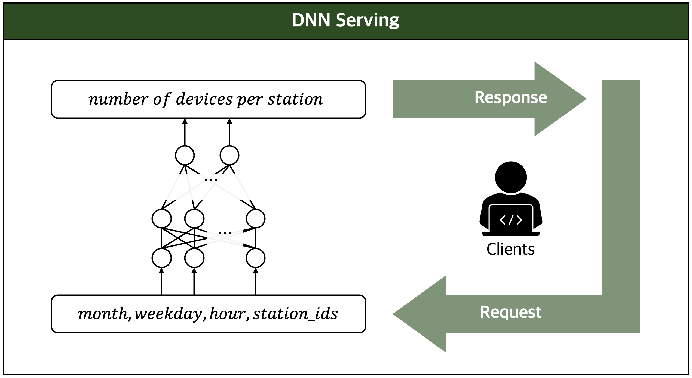

# citibike-DNN
DNN models for citibike prediction

# Install requirements

```
pip install -r requirements.txt
```

# Preprocessing data

Download citibike data via [Link](https://www.citibikenyc.com/system-data).
* Download `201901-citibike-tripdata.csv` ~ `201912-citibike-tripdata.csv`

Then, run `python preprocess.py` .

# Training model

Set training param. in [`training.py`](https://github.com/t-ava/citibike-DNN/blob/master/training.py#L72) like below:

```python
training = True
```

Run `python training.py` .

* Inputs: month, weekday, hour, station_id.
* Outputs: `pred` . number of devices in the station.
       * `pred` > 0: there are spare `pred` devices in the station.
       * `pred` < 0: require extra `|pred|` devices in the station.

We use MAE(Mean Absolute Error) to evaluate our model:
```
loss: 1.9897
```

# Evaluation

Run `python training.py` .

```
>>> loading model complete
array([[ 1.000e+01,  0.000e+00,  9.000e+00,  2.230e+02,  0.000e+00],
       [ 9.000e+00,  3.000e+00,  0.000e+00,  4.330e+02,  0.000e+00],
       [ 1.000e+01,  6.000e+00,  9.000e+00,  7.400e+01,  0.000e+00],
       [ 4.000e+00,  0.000e+00,  1.000e+01,  2.072e+03,  1.000e+00],
       [ 8.000e+00,  4.000e+00,  1.500e+01,  3.737e+03,  0.000e+00],
       [ 3.000e+00,  0.000e+00,  2.200e+01,  8.060e+02,  2.000e+00],
       [ 1.200e+01,  5.000e+00,  5.000e+00,  3.086e+03, -0.000e+00],
       [ 1.200e+01,  4.000e+00,  6.000e+00,  2.800e+02, -0.000e+00],
       [ 1.100e+01,  0.000e+00,  2.200e+01,  2.955e+03,  0.000e+00],
       [ 6.000e+00,  0.000e+00,  1.300e+01,  2.402e+03,  0.000e+00]])
```

[month, weekday, hour, id, prediction_result] per row.

# Inference server



Run `python server.py`

## Request
```bash
curl -X POST -H 'Content-Type: application/json' http://127.0.0.1:5000/post -d '{"month": 12, "weekday": 4, "hour": 6, "ids": [2800, 123, 458, 1311, 3000, 1], "adj": 1}'
```
```
{"res":[0,1,-1,2,-2,0]}
```

`adj` is the flag of reflecting model loss:
* `adj` == 1: adjusting prediction results using loss (1.9897) .
* `adj` == 0: retuning bare prediction results.

# Get data from Ava

Get (address, devices) pair from Ava client via [Pyslopes](https://github.com/t-ava/pyslopes).

Clone Pyslopes.
```bash
git clone https://github.com/t-ava/pyslopes.git
```

Run `python getdata.py` .

```bash
python getdata.py --ip="client ip address" --port="client port number"
```
```
> Setting: Namespace(ip='satoshi.snu.ac.kr', port='9650')
[['0' 'X-A9e3iJbYC4tRdhGV56QPjHNuWyE7Ao7jG' '6']
 ['1' 'X-FC1R55muJFHuTHtMGbvENkNGLCqks1fVZ' '15']
 ['2' 'X-8qozToj6mrGWuGMqD2gy9xySvj68nsBnZ' '15']
 ['3' 'X-3gemEc753hjpWDe4TWFg65xx8xc6MzwvE' '13']
 ['4' 'X-AkpWeXduP5Xkio1ouu1bytH6ksMiNue7D' '11']
 ['5' 'X-BBZpBYNqdWiFmv3PB1fZSBawCDKByhisv' '8']
 ['6' 'X-KvojiLf6QvQPsikFY3WEKbKFED7eA6MAQ' '5']
 ['7' 'X-HRbnGVZEzN774JeSkbRzLQtYRz7wkkUNQ' '8']
 ['8' 'X-9TH3dun9M71g1ymXX4pCJJxpkvMemrMGS' '10']
 ['9' 'X-gRUq2JVEyTmUbxg7zkBzLwqfoshVao5r' '5']
 ['10' 'X-LZCgKuqqRB9s5zHH1nbJc4TCiKcMm9ZKk' '8']
 ['11' 'X-N5APzZUVyitRdQGtLm6cUhfW9K6vRb2KZ' '15']
 ['12' 'X-Ji7DGdcjX9muM1W6hrbexQe4AKDzGU9ua' '7']
 ['13' 'X-AQfdthXkvhA4ohL6rBGSEcwVXyc61YAHS' '12']
 ['14' 'X-81TkjECnMzh8GXNs9WgDT7nG8rcswVtav' '12']
 ['15' 'X-MrdJVdqgE8N7ta3taan9hmv8wDjBGmGGY' '11']
 ['16' 'X-P3Km8LoMKGYZEA2Y789SofjL7oJtp4XVU' '7']
 ['17' 'X-8C9cbgFGckdZnwfA9kufYanrfao6svKfY' '6']
 ['18' 'X-8TwxXH8SUM6xQjqQVx9dQFnoMcNHxZufQ' '8']
 ['19' 'X-4ZcBs4D9fEw5kSBmpSn1toWfec1RHPYva' '13']]
```
